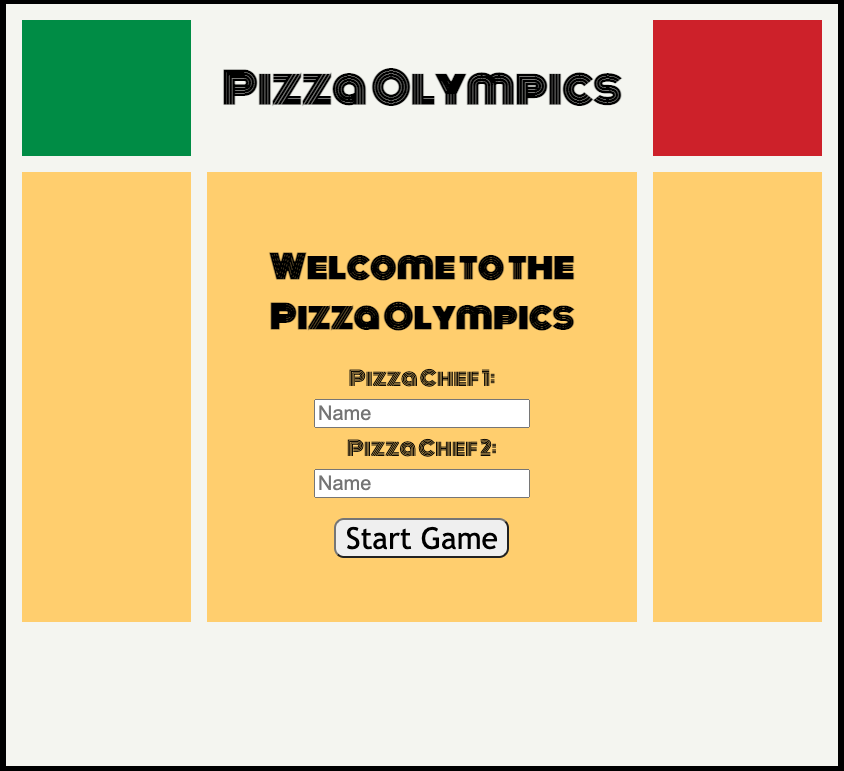

# Pizza Olympics

Pizza Olympics is a cooking competition game. Two players go head to head for one minute each, trying to create as many pizzas as they can. Players are provided a dough base, 14 ingredient buttons, and a bake button to create their pizza. Players will be prompted with a pizza and ingredient list randomly, and must use the ingredient buttons to match the pizza provided.
https://anthonymang.github.io/pizza-olympics-game/

# HOW TO PLAY

In today's challenge, you will be making pizzas suggested by our expert pizza judges. Look out for the Pizza Name and Ingredient List at the bottom of your screen.  Every pizza's ingredients must match the recipe exactly. Click the corresponding ingredient button to add it to the pizza. When your pizza is ready, click 'Bake' to submit it for judgement. If the pizza is the correct recipe, you will receive one point. If you mess up, you will have to start again with a new pizza. The Pizza Chef who makes the most pizzas in one minute will be crowned champion.

## Start Up Screen:


# HOW TO INSTALL

1. *`Fork`* and *`Clone`* this respository to your local machine
2. Open `index.html` in your browser to play or 
3. Open the directory in your text editor of choice to view or edit the code


# HOW IT WORKS
Start Screen - Form Field Entries are stored as variable, added to DOM in top left and right on submit.
Instructions Screen - Plays startup music using new Audio - play(). Removes form elements and title, add Instructions title and copy and start button using DOM. Advance on click.
Gameplay - 

Each Pizza is an array with all of the needed ingredients. Then created a larger array of all of those pizzas. Pizza to be displayed is chosen by selecting a random pizza from the array.
``` js
// Choose Random Pizza - Run displayPizzaType to update name & ingredients list
Array.prototype.sample = function(){
    randPizza = this[Math.floor(Math.random()*this.length)];
    displayPizzaType();
  }

  // Function for displaying requested pizza name and ingredients
function displayPizzaType(){
    if (pizzaArray.indexOf(randPizza) === 0){
        pizzaType.innerText = 'Cheese';
        ingredientList.innerHTML = 'Ingredients<br>Sauce, Cheese';

```

When user clicks ingredient buttons, event listener runs ingredientClick function. Corresponding ingredient is added to array using array.push and image is added to screen using DOM. Used Z-Index css property to make sure sauce & cheese did not show up on top of other ingredients.
``` js
function pepperoniClick(){
    userArray.push('pepperoni');
    createPizzaImage(pepperoniImg, './pizza-assets/pepperoni.png', '3');
}

function createPizzaImage(ingredientName, imgSrc, zIndex) {
    ingredientName.src = imgSrc;
    ingredientName.style.position = 'absolute';
    ingredientName.style.top = '50%';
    ingredientName.style.left = '50%';
    ingredientName.style.transform = 'translate(-50%, -50%)';
    ingredientName.style.zIndex = zIndex;
    game.append(ingredientName);
}
```

When user hits bake button, it compares the user-created array to the random array that was chosen by the Math.random function. If they match, add one to score. If not, reset pizza.
```js 
// compare pizza created by user to pizza array given. add score to player 1
function playerOneBake() {
    compareArray = userArray.sort();
    if (compareArray.length === randPizza.length && compareArray.every(function(value, index) { return value === randPizza[index]})
    ){
        woohoo.play();
        playerOneCurrentScore++;
        playerOneScore.innerHTML = `${playerOne.value}<br>Pizzas: ${playerOneCurrentScore}`;        
        pizzaType.innerText = '';
        ingredientList.innerText = "Nice pizza, how about another?"
        setTimeout(PizzaReset, 1000)
        userArray = [];
        compareArray = [];
        randPizza =[];

    } else {
        oof.play();
        pizzaType.innerText = ':('
        ingredientList.innerHTML = "Sorry, that's the wrong pizza.<br>Try again"
        setTimeout(PizzaReset, 1500)
        userArray = [];
        compareArray = [];
        
    }
    while (game.firstChild){
        game.removeChild(game.lastChild);
    }
    game.append(pizzaDough);
    game.append(bakeButtonUserOne);

}
```

60 Second timer using Set Interval (remove one from timeRemaining variable every second) and Set Timeout (clear interval after 60 seconds, reset time remaining variable to 60). After 60 seconds, use while loop to remove any remaining elements from the screen - this allows the game to remove any possible elements user has added to screen.
```js
// Run Countdown Timer - Set time to 60, Run set interval every 1 second, timeout after 60 seconds
function countdownTimerPlayerOne(){
    timer.innerText = `Time: ${timeRemaining}`;
    myTimer = setInterval(timeLower, 1000);
    setTimeout(timesUpPlayerOne, 60000);
}

// Callback function for set interval - takes time down by 1 and updates screen with new time
function timeLower(){
    timeRemaining-=1;
    timer.innerText = `Time: ${timeRemaining}`;
}

// Callback function for set Timeout - clear interval timer, remove buttons, add text and new buttons
function timesUpPlayerOne (){
    clearInterval(myTimer);
    while (game.firstChild){
        game.removeChild(game.lastChild);
    }
    while (gameLeft.firstChild){
        gameLeft.removeChild(gameLeft.lastChild);
    }
    while (gameRight.firstChild){
        gameRight.removeChild(gameRight.lastChild);
    }
    
    pizzaType.innerText = '';
    ingredientList.innerText = '';
    timer.innerText = '';
    playerOneScoreRecap.innerText = `${playerOne.value} made ${playerOneCurrentScore} pizzas. Now it's your turn, ${playerTwo.value}. Do you have what it takes to be the champion?`
    game.append(playerOneScoreRecap);
    game.append(startGameUserTwo);
}
```

User 2 Gameplay is same as player 1.

After game is over, scores are compared and a message is displayed depending on user scores.
``` js
// compare scores and generate proper winner message
function determineWinner(score1, score2){
    if (score1 > score2){
        endGameMessage.innerHTML = `With a grand total of ${score1} pizzas, ${playerOne.value} wins.<br>Congrats ${playerOne.value}!`;
    } else if (score1 < score2) {
        endGameMessage.innerHTML = `With a grand total of ${score2} pizzas, ${playerTwo.value} wins.<br>Congrats ${playerTwo.value}!`;
    } else if (score1 == score2){
        endGameMessage.innerHTML = `It's a tie!<br>Play again to determine the true champion`;
    }
    game.append(endGameMessage);
}
```

# FUTURE CONSIDERATIONS

Stretch goals
- Add a first to 10 pizzas gameplay style. Time counts up and fastest time wins.
- Create a character select, have that character animated to add toppings.


## Scratch Work:

See - disused.js - for scrapped/re-factored code.
